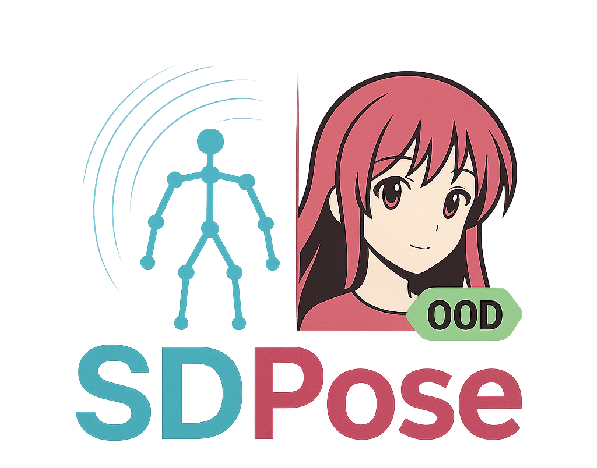

<div align="center">



# SDPose: Exploiting Diffusion Priors for Out-of-Domain and Robust Pose Estimation

[](https://t-s-liang.github.io/SDPose)
[](https://arxiv.org/abs/2509.24980)
[](https://huggingface.co/teemosliang/SDPose-Body)
[](https://huggingface.co/teemosliang/SDPose-Wholebody)
[](https://huggingface.co/spaces/teemosliang/SDPose)
[](https://opensource.org/licenses/MIT)

[Shuang Liang](https://t-s-liang.github.io)<sup>1,4*</sup>,
[Jing He](https://scholar.google.com/citations?hl=en&user=RsLS11MAAAAJ)<sup>3</sup>,
Chuanmeizhi Wang<sup>1</sup>,
Lejun Liao<sup>2</sup>,
Guo Zhang<sup>1</sup>,
[Ying-Cong Chen](https://www.yingcong.me/)<sup>3,5</sup>
[Yuan Yuan](https://yyuanad.github.io/)<sup>2†</sup>

<sup>1</sup>Rama Alpaca Technology Company, <sup>2</sup>Boston College, <sup>3</sup>HKUST(GZ), <sup>4</sup>The University of Hong Kong, <sup>5</sup>HKUST

<sup>*</sup>Work done during an internship at Rama Alpaca Technology. <sup>†</sup>Corresponding author.

</div>

---

## 📢 News
- **[2025-Oct-14]** 🚀 **Wholebody model** and **Huggingface Space Demo** released! You can now run SDPose demos in our Huggingface space! Check out our [🤗 SDPose Huggingface Space](https://huggingface.co/spaces/teemosliang/SDPose) and [🤗 SDPose-Wholebody Model Repository](https://huggingface.co/teemosliang/SDPose-Wholebody).
- **[2025-Oct-13]** 🚀 **Gradio local deployment script** released! You can now run SDPose demos locally on your machine.
- **[2025-Oct-12]** 🎉 **Body model**, **COCO-OOD validation Benchmark** and **inference code** released! Check out our [🤗 SDPose-Body Model Repository](https://huggingface.co/teemosliang/SDPose-Body).
- **[2025-Sep-29]** 📄 Paper released on [arXiv](https://arxiv.org/abs/2509.24980).

### 🚀 Coming Soon

- [x] **HuggingFace space demo** release
- [x] **WholeBody model** release  
- [x] **Gradio local deployment script** release
- [x] **Body model** and **Inference code** release
- [x] **COCO-OOD Validation Benchmark** release
---

## 🔥 Highlights

**SDPose** leverages the powerful visual priors from **Stable Diffusion** to achieve state-of-the-art performance in:

- ✅ **Out-of-Domain (OOD) Generalization**: Superior performance on unseen domains without fine-tuning
- ✅ **Robust Pose Estimation**: Handles challenging scenarios including occlusions, rare poses, and artistic styles
- ✅ **Body & Wholebody Support**: Supports both body keypoints (17) and wholebody keypoints (133)

---

## 🎬 Demo: Animation Video Pose Estimation in the Wild

**SDPose** demonstrates robust performance on animation videos.

<table>
  <tr>
    <td align="center" width="25%">
      <div style="position: relative; overflow: hidden; width: 100%; height: 300px; border-radius: 10px;">
        
      </div>
    </td>
    <td align="center" width="25%">
      <div style="position: relative; overflow: hidden; width: 100%; height: 300px; border-radius: 10px;">
        
      </div>
    </td>
    <td align="center" width="25%">
      <div style="position: relative; overflow: hidden; width: 100%; height: 300px; border-radius: 10px;">
        
      </div>
    </td>
    <td align="center" width="25%">
      <div style="position: relative; overflow: hidden; width: 100%; height: 300px; border-radius: 10px;">
        
      </div>
    </td>
  </tr>
</table>

> 💡 **Tip**: For more interactive demos and real-time inference, check out our [🤗 HuggingFace Spaces](https://huggingface.co/spaces/teemosliang/SDPose-Body)!

---

## 🎨 Visualization

### Body Pose Estimation (17 Keypoints)

<div align="center">

</div>

### Wholebody Pose Estimation (133 Keypoints)

<div align="center">

</div>

---

## 🛠️ Setup

### Installation

1. **Clone the repository**

```bash
git clone https://github.com/t-s-liang/SDPose-OOD.git
cd SDPose-OOD
```

2. **Create a conda environment**

```bash
conda create -n SDPose python=3.10
conda activate SDPose
```

3. **Install dependencies**

```bash
pip install -r requirements.txt
```

### Download Pre-trained Models

Download the pre-trained **Body model** checkpoint from our HuggingFace Model repository:

**🤗 [SDPose-Body Model](https://huggingface.co/teemosliang/SDPose-Body)**
**🤗 [SDPose-Wholebody Model](https://huggingface.co/teemosliang/SDPose-Wholebody)**
The model repository contains the checkpoint files and detailed usage instructions.

## 🤗 Gradio Demo

We provide interactive **Gradio demos** on HuggingFace Spaces:

- 🤗 **[SDPose Huggingface Space Demo](https://huggingface.co/spaces/teemosliang/SDPose)**

### Run Gradio Demo Locally

You can now run the Gradio demo on your local machine! 

#### Prerequisites

Since SDPose is a **top-down pose estimation** method, it requires an object detection model to detect humans in the image first. We recommend using **YOLO11-x** for robust human detection:

**Download YOLO11-x model:**
```bash
# Download the YOLO11-x pretrained model
wget https://github.com/ultralytics/assets/releases/download/v8.3.0/yolo11x.pt -P models/
```

#### Launch Gradio App

```bash
cd gradio_app
bash launch_gradio.sh
```

The Gradio interface will be available at `http://localhost:7860` (or the port specified in the launch script).

---

## 🕹️ Inference

### Evaluation

Use the provided evaluation script to run inference on standard pose estimation benchmarks.

#### Configuration

Edit `scripts/eval.sh` to configure the evaluation parameters:

```bash
# Dataset settings
dataset_name='COCO'              # Dataset name: COCO, HumanArt, etc.
keypoint_scheme='body'           # 'body' (17 keypoints) or 'wholebody' (133 keypoints)
dataset_root='/path/to/datasets' # Root directory of datasets
ann_file='/path/to/annotation.json' # Annotation file path

# Model settings
checkpoint_path='/path/to/checkpoint' # Path to SDPose checkpoint

# Inference settings
eval_batch_size=16               # Batch size per GPU
dataloader_num_workers=16        # Number of data loading workers
```
#### Dataset Preparation and Evaluation

For COCO evaluation, please download the precomputed person detection bounding boxes from:
https://huggingface.co/noahcao/sapiens-pose-coco/tree/main/sapiens_host/pose/person_detection_results

These detection results are required for evaluation under the top-down protocol on COCO, COCO-OOD, and COCO-WholeBody.

The expected directory structure is:
```bash
${DATASET_ROOT}/
│
├── COCO/
│   ├── annotations/
│   │   ├── person_keypoints_train2017.json
│   │   ├── person_keypoints_val2017.json
│   │   ├── coco_wholebody_train_v1.0.json
│   │   └── coco_wholebody_val_v1.0.json
│   │
│   ├── train2017/
│   ├── val2017/
│   ├── val2017oil/
│   └── person_detection_results/
│       └── COCO_val2017_detections_AP_H_70_person.json
│
└── HumanArt/
    ├── annotations/
    │   └── validation_humanart.json
    └── images/

When running evaluation, the dataloader will automatically locate the correct annotation and bounding box files based on the specified dataset name:
- COCO → standard COCO validation
- COCO_OOD → COCO stylized (val2017oil)
- COCOWholebody → COCO-WholeBody validation
- COCO-OOD_Wholebody → COCO-WholeBody OOD validation
- HumanArt → HumanArt validation set
```

#### Run Evaluation

```bash
cd scripts
bash eval.sh
```

This will:
1. Load the SDPose model from the checkpoint
2. Run inference on the specified dataset
3. Compute evaluation metrics (AP, AR, etc.)
4. Print results to console

---

## 📊 COCO-OOD Dataset

<div align="center">

</div>

To complement the HumanArt dataset and enable OOD evaluation under matched content and labels, we constructed **COCO-OOD** by applying artistic style transfer to the original COCO images. 

### Dataset Construction

We adopt the official [CycleGAN](https://github.com/junyanz/CycleGAN) framework to perform unpaired image-to-image translation from the COCO domain (natural photographs) to the target domain of Monet-style paintings. We use the `monet2photo` model provided in the CycleGAN repository. During conversion, all validation images in COCO are processed to produce style-transferred counterparts, while preserving their original human annotations (bounding boxes, keypoints). This yields an OOD variant of COCO in which the underlying scene structure is unchanged, but the texture, color palette, and brushstroke patterns are consistent with Monet's artistic style.

Importantly, for fair comparison and to avoid introducing priors from large-scale pretrained diffusion models, we intentionally adopt the earlier CycleGAN framework rather than more recent style transfer methods. Such stylization introduces a significant appearance shift while keeping pose-related geometric information intact, making it suitable for robust pose estimation evaluation.

### Download

📥 **[Download COCO-OOD Dataset](https://drive.google.com/file/d/1T38S8gP406FGAoDmYv7eeThMWRLi3DkR/view)** from Google Drive

---

## 🎓 Citation

If you find SDPose useful in your research, please consider citing:

```bibtex
@misc{liang2025sdposeexploitingdiffusionpriors,
      title={SDPose: Exploiting Diffusion Priors for Out-of-Domain and Robust Pose Estimation}, 
      author={Shuang Liang and Jing He and Chuanmeizhi Wang and Lejun Liao and Guo Zhang and Yingcong Chen and Yuan Yuan},
      year={2025},
      eprint={2509.24980},
      archivePrefix={arXiv},
      primaryClass={cs.CV},
      url={https://arxiv.org/abs/2509.24980}, 
}
```

---

## 📄 License

This project is released under the [MIT License](LICENSE).

---

## 🙏 Acknowledgements

This project is built upon the following excellent open-source projects:

- [MMPose](https://github.com/open-mmlab/mmpose): OpenMMLab pose estimation toolbox
- [Diffusers](https://github.com/huggingface/diffusers): HuggingFace diffusion models library
- [Marigold](https://github.com/prs-eth/marigold): Diffusion-based depth estimation
- [Lotus](https://github.com/EnVision-Research/Lotus): Diffusion-based dense prediction
- [Stable Diffusion](https://github.com/Stability-AI/stablediffusion): Latent diffusion models
- [CycleGAN](https://github.com/junyanz/CycleGAN): Unpaired Image-to-Image Translation

---

## 📧 Contact

For questions, suggestions, or collaboration inquiries:

- **Shuang Liang**: [tsliang2001@gmail.com](mailto:tsliang2001@gmail.com)
- **Project Page**: [https://t-s-liang.github.io/SDPose](https://t-s-liang.github.io/SDPose)

---

<div align="center">
**⭐ Star us on GitHub — it motivates us a lot!**

[🌐 Website](https://t-s-liang.github.io/SDPose) | [📄 Paper](https://arxiv.org/abs/2509.24980) | [🤗 Model](https://huggingface.co/teemosliang/SDPose-Body) | [🤗 Demo](https://huggingface.co/spaces/teemosliang/SDPose-Body)

</div>
